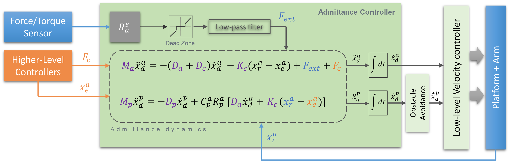

# Ridgeback+Ur5 Controller [DEVEL]
[](https://travis-ci.com/epfl-lasa/ridgeback_ur5_controller)

This repository provides several contollers for the Ridgeback mobile-robot with Ur5 robotic-arm. 


* [admittance_control](https://github.com/epfl-lasa/ridgeback_ur5_controller/tree/devel/admittance_control): 
This package implements an admittance controller on the ridgeback+UR5 platform (see below for the control architecture). 
* [ur5_cartesian_velocity_control](https://github.com/epfl-lasa/ridgeback_ur5_controller/tree/devel/ur5_cartesian_velocity_control): This package provides a cartesian velocity controller (ros control) for the UR5 arm. 
* [obstacle_avoidance](https://github.com/epfl-lasa/ridgeback_ur5_controller/tree/devel/obstacle_avoidance): This package provides a simple obstacle-avoidance for the platform. It looks for the nearest obstacle using the laser sensors and remove the velocity components in that direction.
* [cpr_bringup](https://github.com/epfl-lasa/ridgeback_ur5_controller/tree/devel/cpr_bringup): This package provides a series of launch files and ROS settings in order to start-up the real-robot as well as the simulator. 
* [cpr_mocap_tracking](https://github.com/epfl-lasa/ridgeback_ur5_controller/tree/devel/cpr_mocap_tracking): This package enables the robot to track an object (using mocap system) in its own frame of references (automatic calibration is included).
* [cartesian_state_msgs](https://github.com/epfl-lasa/ridgeback_ur5_controller/tree/devel/cartesian_state_msgs): It contains the defintion of message type "PoseTwist" (combination of the standard ros/geometry_msgs pose and twist).


---

## Compliation and build

Clone the repository intor your catkin source directory
```bash
$ cd ~/catkin_ws/src
$ git clone git@github.com:epfl-lasa/ridgeback_ur5_controller.git
```

Get the source dependencies using wstool
```bash
$ wstool init
$ wstool merge ridgeback_ur5_controller/dependencies.rosinstall
$ wstool up
```
Get the package dependencies using rosdep
```bash
$ rosdep install -y --from-paths src --ignore-src --rosdistro indigo
```
You also need the following ros packages
```bash
$ sudo apt-get install ros-indigo-ridgeback-*
$ sudo apt-get install ros-indigo-universal-robot
```
if you are getting error for broken packages (most probably due to a wrong version of gazebo), you can use 'aptitude' instead of 'apt-get' which propose a solution and resolve the conflict. 


Finally complie
```bash
$ cd ~/catkin_ws
$ catkin_make
$ source devel/setup.bash
$ catkin_make
```
* you might need the source the bash file and compie again if the first compliation could not find some of in house dependencies.


For simulator, you can use gazebo7
```bash
$ sudo apt-get install ros-indigo-gazebo7-*
```
You might need to follow [these instructions](http://gazebosim.org/tutorials?tut=install_ubuntu#Alternativeinstallation:step-by-step).

---
---


## Running the controller


To bring up the robot in simulation run
```
roslaunch cpr_bringup cpr_bringup.launch
roslaunch admittance_control admittance_controller.launch
```
For the real robot launch on the CPR main PC run
```
roslaunch cpr_bringup cpr_bringup.launch sim:=false
roslaunch admittance_control admittance_controller_real.launch
```

# Expected behaviors

The behavior of different components are demonstrated here:
* [admittance control](https://youtu.be/e6_z8rCOoIs) and its [rviz](https://youtu.be/T10rhY_HqZo)
* [obstacle avoidance](https://youtu.be/tqsskZV-D6A) and its [rviz](https://youtu.be/m-LsolZWia8).
* [object tracking](https://youtu.be/k5OMNfCmOGY) and its [rviz](https://youtu.be/ru9Xr6W0rQE).


# Control Architecture

## Kinematics and transformations

Here is a short list of important frames and their usage.

| frame id      | Usage                         |
|---------------|-----------------------------------|
| world                          | Odometry and navigation           |
| ur5_arm_base_link              | Arm pose and twist                |
| base_link                      | Platform pose and twist           |
| robotiq_force_torque_frame_id  | External force applied to the end-effector           |


## Adamittance dynamics
The following figure shows the controller architecture for the admittance control on the robot.



The two equations in the center describe the admittance dynamics which compute the desired accelaration for the arm and the platform. These accelerations are integrated in time to acheive the desired velocities for the robot. The low-level velocity controller fullfills these velocities. In the case of platform, the computed velocities can be modified accroding to obstacle avoidance node.


The admittance parameters (shown in purple) are as follows: 

| Variable      | Parameter                         |
|---------------|-----------------------------------|
| M<sub>a</sub> | Desired mass of the arm           |
| D<sub>a</sub> | Desired damping of the arm        |
| D<sub>c</sub> | Desired damping of the coupling   |
| K<sub>c</sub> | Desired Stiffness of the coupling |
| M<sub>p</sub> | Desired mass of the platform      |
| D<sub>p</sub> | Desired damping of the platform   |

These parameters are load from a yaml through the launch file.


### External force
The external is initially measured by the force/torque sensor in its own frame reference. In admittance controller this force is transformed to "ur5_arm_base_link" where the control of arm takes place. To avoid reacting to small forces a deadzone is considered. Moreover, a low-pass filter is used to smooth the measurements. The parameters of the deadzone and the filter can be set from the launch file.

### Higher-level control (Motion planning )
Through a higher level controller, the position of the equilibrium can be can be changed to acheive a desired behavior. Also, F<sub>c</sub> can be used for control purposes; e.g., to compensate for the mass of an object carried by the arm.

[](https://youtu.be/7BjHhV-BkwE)


